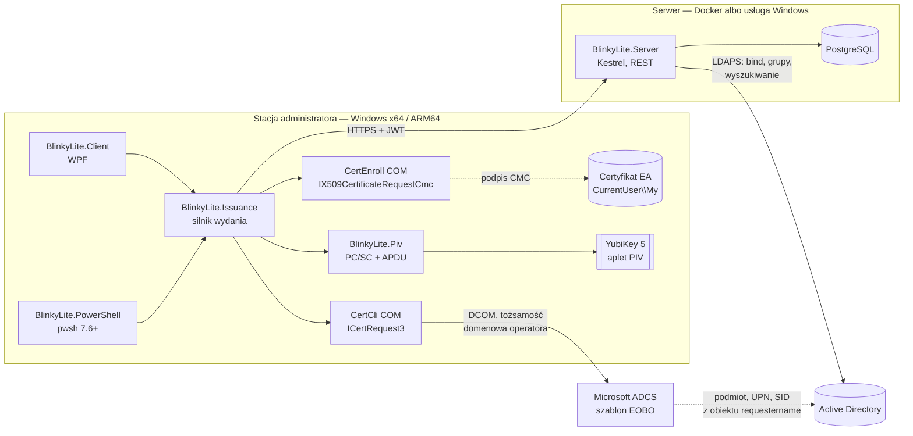
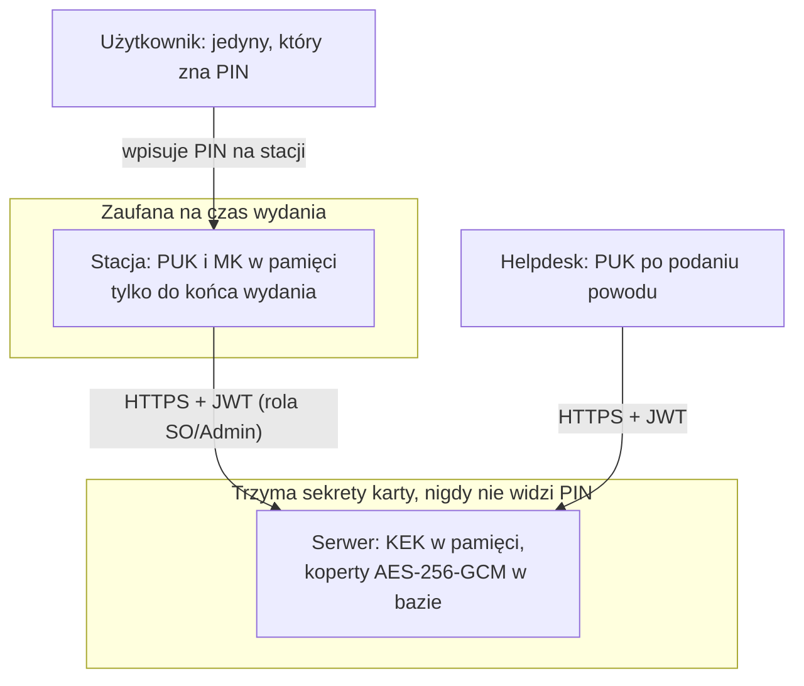
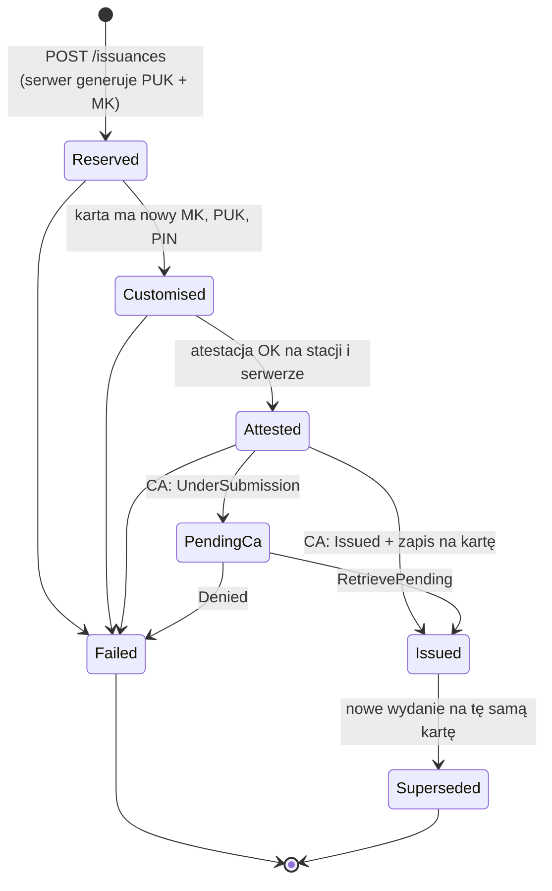

# 01 — Architektura

## Po co i czego tu nie ma

BlinkyLite istnieje, bo pełny CMS (Blinky) jest za duży dla zespołu, który
chce tylko **wydać klucz PIV z ADCS i nie zgubić PUK**. Wszystko, co nie służy
temu jednemu celowi, jest poza zakresem:

| Poza zakresem | Dlaczego |
|---|---|
| Wbudowane CA, Samba4, CES/CEP | Tylko ADCS, tylko przez mechanizm Windows |
| Agent w tle, kolejka zadań, SignalR | Wydanie jest interaktywne i synchroniczne na stacji |
| Odnowienia, CRL/OCSP | ADCS / Blinky. BlinkyLite po 1.0 tylko **powiadamia** przez bota Teams, że certyfikat wygaśnie (0060, [09](09-expiry-notification.md)) |
| Konsola webowa | Przeglądarka wydań jest w WPF |
| Zmiana / rotacja PUK, odblokowanie PIN, dalsze życie karty | To robi **Blinky** |
| Reset PIV, `SET PIN RETRIES` | `ykman` albo Blinky |
| Edycja profili i mapowania ról w UI | `appsettings.json` serwera |

Po wydaniu BlinkyLite dotyka karty już tylko w trybie **weryfikacji**:
odczyt serialu, certyfikatu i atestacji z 9A i porównanie z tym, co zapisano
przy wydaniu. Nic nie pisze.

## Komponenty

**Jeden silnik, dwie powłoki.** Cała logika wydania — personalizacja karty,
atestacja, budowa CMC, wysyłka do CA, rozmowa z serwerem — siedzi w
`BlinkyLite.Issuance`. WPF i moduł PowerShell tylko zbierają dane wejściowe
(użytkownik docelowy, szablon, PIN) i pokazują postęp. Dzięki temu oba
warianty wydają identycznie i mają te same testy. Silnik raportuje postęp
przez `IProgress<IssuanceStep>` i prosi o PIN przez interfejs
`IPinPrompt` — WPF implementuje go oknem, PowerShell przez
`Read-Host -AsSecureString` / `PSHostUserInterface`.

**Serwer nie rozmawia z CA ani z kartą.** Jego zadania: uwierzytelnić
operatora w AD i wystawić JWT, wyszukać użytkownika docelowego w AD,
wygenerować i przechować zaszyfrowane sekrety karty, zweryfikować atestację
i certyfikat po swojej stronie, prowadzić audyt, udostępnić przeglądarkę.
Dzięki temu serwer może być kontenerem Linux bez DCOM i bez członkostwa w
domenie.

**Wydanie certyfikatu robi Windows.** Stacja buduje żądanie CMC przez
CertEnroll (`IX509CertificateRequestCmc`, `SignerCertificate` = EA,
`RequesterName` = `DOMENA\użytkownik`) i wysyła je przez `ICertRequest3`
jako zalogowany operator. Szablon, podmiot, UPN i rozszerzenie SID ustala
ADCS na podstawie AD. Działający w labie ręczny builder CMC z Blinky
(`CmcRequest.cs`) jest planem awaryjnym — patrz D-04.

## Warianty wdrożenia serwera

| | Docker | Windows |
|---|---|---|
| Host | Linux, `docker compose` | Windows Server, usługa (`UseWindowsService`) |
| Obraz / instalator | `mcr.microsoft.com/dotnet/aspnet:10.0` + `libldap` | **MSIX** z usługą Windows |
| PostgreSQL | kontener w compose albo zewnętrzny | zewnętrzny / lokalna instalacja |
| TLS | Kestrel, certyfikat z wolumenu | Kestrel, certyfikat z magazynu `LocalMachine\My` |
| KEK | zmienna / Docker secret | plik chroniony DPAPI (maszyna) w `%ProgramData%\BlinkyLite` |
| Konfiguracja | `appsettings.json` z wolumenu + env | `%ProgramData%\BlinkyLite\appsettings.json` — katalog paczki MSIX jest tylko do odczytu |
| Logowanie AD | LDAPS bind | LDAPS bind |

Konfiguracja jest ta sama (`appsettings.json` + zmienne `BLINKYLITE__…`);
różni się tylko źródło sekretów i sposób startu. Migracje bazy uruchamia
serwer z `--migrate` na osobnym koncie właściciela schematu — patrz
[07 — Baza danych](07-database.md#migracje). Profile wydania (szablon ADCS,
CA, algorytm, polityka PIN/touch) i mapowanie grup AD na role są sekcjami
`Profiles` i `Roles` w `appsettings.json`.

## Instalacja MSIX

| Paczka | Zawartość | Uwagi |
|---|---|---|
| `BlinkyLite.Client.msixbundle` | WPF + silnik, `win-x64` i `win-arm64` w jednym bundle | Windows wybiera architekturę sam |
| `BlinkyLite.Server.msix` | serwer jako usługa (`desktop6:Service`) | wymaga Windows Server 2022 / Windows 10 2004+ i ograniczonej zdolności `packagedServices`; ryzyko R-05 |
| `BlinkyLite.PowerShell.nupkg` | moduł PowerShell | **nie w MSIX**: pliki paczki MSIX leżą w `WindowsApps`, poza `PSModulePath`, a MSIX nie zmienia zmiennych środowiskowych. Instalacja: `Install-PSResource` z firmowego repozytorium (udział sieciowy) |

Wszystkie paczki podpisane certyfikatem code signing z firmowego ADCS;
stacje i serwer muszą mu ufać (GPO). Niepodpisanego MSIX Windows nie
zainstaluje.

## Role i granice zaufania

| Rola (grupa AD → claim `role`) | Może |
|---|---|
| `Admin` | wszystko: wydanie, przeglądanie, PUK, management key, audyt |
| `SecurityOfficer` | wydanie, przeglądanie, PUK |
| `Helpdesk` | lista użytkownik — klucz — data; PUK dopiero po wybraniu wpisu (WPF) albo wskazaniu użytkownika/serialu (PowerShell). Bez szczegółów certyfikatu i atestacji, bez weryfikacji karty |

Operator z wieloma grupami dostaje sumę uprawnień. Użytkownik bez żadnej
z grup nie dostaje tokenu (403 `error.auth.no-role` — hasło było poprawne,
więc to nie jest nieudane logowanie).

Grupy `Admin` i `SecurityOfficer` są jednocześnie grupami Enrollment Agenta na
CA (D-17): jeśli ktoś może wydać kartę w BlinkyLite, to znaczy, że CA też mu
na to pozwala.

Dwie tożsamości w jednym wydaniu: **JWT** mówi serwerowi, kim jest operator
w BlinkyLite; **Windows** mówi CA, kto wysyła żądanie EOBO i czyj jest
certyfikat EA. Mogą się różnić (np. konto `adm-` do Windows i zwykłe do
BlinkyLite). Audyt zapisuje obie.

## Stan wydania

`Failed` po `Reserved` **nie** usuwa sekretów: jeśli karta zdążyła dostać nowy
management key, koperta w bazie jest jego jedyną kopią. Szczegóły w
[02 — Wydanie klucza](02-issuance.md#odzyskiwanie).

## Decyzje

| ID | Decyzja | Dlaczego |
|---|---|---|
| D-01 | .NET 10 wszędzie; klient `net10.0-windows`, RID `win-x64` i `win-arm64` | jedna platforma, CertEnroll i WinSCard są natywne na ARM64 |
| D-02 | Warstwa PIV przeniesiona z `Blinky.Piv`, nie Yubico SDK | kod sprawdzony na 5.4.3, 5.7.1, 5.8.0 i Bio; reguły z pomiarów już w nim są |
| D-03 | Serwer generuje PUK i MK **przed** dotknięciem karty | sekret istnieje w bazie, zanim karta go dostanie — awaria stacji nie gubi klucza |
| D-04 | CMC przez CertEnroll; ręczny builder z Blinky jako rezerwa | wymóg „proces wbudowany w Windows”; builder z Blinky jest sprawdzony w labie |
| D-05 | Management key losowy i przechowywany (nie wyprowadzany jak w Blinky) | wymóg: MK ma trafić do bazy i być odczytywalny przez Admina |
| D-06 | MK zapisany też w PRINTED za PIN-em + flaga ADMIN DATA | inaczej minidriver Yubico nadpisze MK losowym i zablokuje PUK (Blinky, 08) |
| D-07 | NHibernate + FluentNHibernate do odczytu, encje tylko do odczytu | framework znany właścicielowi projektu; Fluent prostszy niż mapping-by-code z Blinky |
| D-07a | Zapis wyłącznie przez funkcje PL/pgSQL `bl_*`; rola aplikacji bez `INSERT/UPDATE/DELETE` | reguły stanów + audyt atomowo w bazie, nie do ominięcia — [07](07-database.md) |
| D-07b | Schemat w numerowanych skryptach SQL, nie generowany z mapowań | przy procedurach SQL jest źródłem prawdy; mapowania sprawdza `SchemaValidator` |
| D-08 | JWT HS256, 30 min, bez refresh tokenu | jeden wystawca i jeden odbiorca; ponowne logowanie jest tanie |
| D-09 | Logowanie przez LDAPS bind z poświadczeniami operatora | działa z kontenera Linux bez członkostwa w domenie |
| D-10 | Moduł PowerShell binarny, na tym samym silniku | brak rozjazdu zachowania WPF ↔ PowerShell |
| D-11 | MSIX jako instalator (klient bundle x64+ARM64, serwer Windows); moduł PS jako `.nupkg` | decyzja właściciela; moduł nie może żyć w MSIX (poza `PSModulePath`) |
| D-12 | Języki EN, DE, SV, PL; jeden katalog `.resx`; serwer zwraca kody, klient tłumaczy | decyzja właściciela — [08](08-localization.md) |
| D-13 | Profile i mapowanie ról w `appsettings.json`, bez edycji w UI | mniej kodu; edycja w UI poza zakresem |
| D-14 | Helpdesk widzi listę użytkownik — serial — data; PUK tylko po wybraniu jednego wpisu / wskazaniu w PowerShell | decyzja właściciela; osobny DTO listy, brak endpointu z wieloma PUK |
| D-15 | Tłumaczenia pisze AI razem z kodem, prostym językiem | decyzja właściciela; słowniczek pilnuje spójności terminów |
| D-16 | Po 1.0: powiadomienie o wygaśnięciu certyfikatu przez jednokierunkowego bota Teams (0060) | decyzja właściciela; jedyny kod działający bez operatora, tylko informuje; bez SDK bota i bez endpointu przychodzącego |
| D-17 | Grupy AD mapowane na `Admin` i `SecurityOfficer` to te same grupy, które mają uprawnienia Enrollment Agenta na CA | decyzja właściciela; jedna lista zamiast dwóch, które można rozjechać — serwer odmawia startu, gdy obie są puste |
| D-18 | Sekrety serwera tylko z pliku sekretu (Docker secret / DPAPI maszyny) albo zmiennej; w `appsettings.json` zatrzymują start | decyzja właściciela; „tymczasowo” wpisane hasło zostaje na zawsze — [04](04-security.md#sekrety-na-serwerze) |
| D-19 | Dane dają się wyeksportować do Blinky; sekrety w paczce zaszyfrowane do certyfikatu Blinky | decyzja właściciela; bez tego przejście na pełny CMS to ponowne wydanie każdej karty — [10](10-blinky-export.md) |
| D-20 | Akcent klienta `#1DB954` (zieleń bloga), oba motywy wg ustawienia Windows | decyzja właściciela; role koloru rozdzielone, bo ta zieleń daje 8,1:1 z czernią i tylko 2,6:1 z bielą — [02](02-issuance.md#kolory-d-20) |
