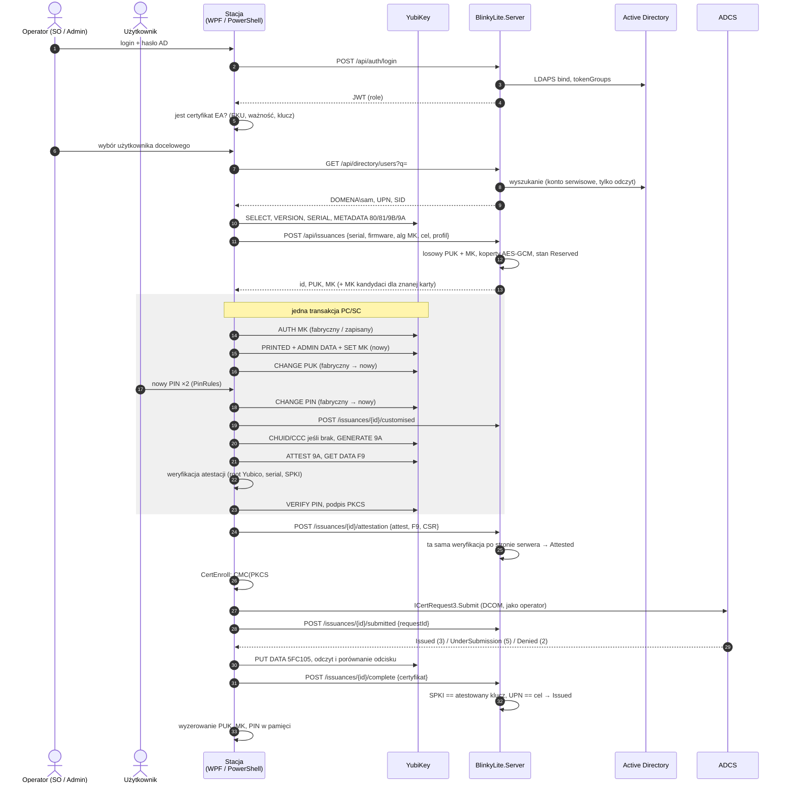

# 02 — Wydanie klucza

Ten dokument opisuje jedno wydanie od zalogowania operatora do certyfikatu na
karcie. Kolejność kroków nie jest dowolna — większość z niej wynika z
pomiarów w Blinky ([06](06-from-blinky.md)), a reszta z tego, żeby żadna
awaria nie zostawiła karty z sekretem, którego nie ma w bazie.

## Sekwencja

## Kroki i powody

| # | Krok | Szczegół | Dlaczego tak |
|---|---|---|---|
| 1 | Sprawdzenie EA **przed** kartą | EKU `1.3.6.1.4.1.311.20.2.1`, daty, klucz prywatny obecny, brak strong key protection | nie personalizujemy karty, której i tak nie da się wydać |
| 2 | Wybór celu przez serwer | wynik: `DOMENA\sAMAccountName`, UPN, `objectSid` | `RequesterName` musi mieć dokładnie jeden `\`; bez niego CA wyda certyfikat operatorowi |
| 3 | Odczyt karty | `GET SERIAL` rozpoznaje YubiKey; algorytm MK **z `GET METADATA 9B`**, nie z wersji | 3DES < 5.7 ≤ AES-192, ten sam bajtowy klucz fabryczny |
| 4 | Rezerwacja na serwerze | serwer losuje PUK (8 cyfr) i MK (24 B), zapisuje koperty, zwraca je stacji | D-03: sekret jest w bazie, zanim karta go dostanie |
| 5 | Jedna transakcja PC/SC | `SCARD_SHARE_SHARED` + `BeginTransaction` na całą sekwencję | inaczej `SCARD_E_SHARING_VIOLATION` od pollingu / minidrivera |
| 6 | **nie** wysyłamy `SET PIN RETRIES` | liczba prób zostaje fabryczna | `00 FA` resetuje PIN **i** PUK do fabrycznych; poza zakresem BlinkyLite |
| 7 | Nowy MK | PRINTED `5FC109` (`88 {89 key}`), flaga `0x02` w ADMIN DATA `5FFF00`, potem `00 FF FF FF <alg> 9B` | bez PRINTED + flagi minidriver Yubico ustawi własny losowy MK i zablokuje PUK |
| 8 | Nowy PUK | `00 24 00 81` fabryczny‖nowy | PUK nie jest wybierany przez człowieka |
| 9 | PIN od użytkownika | 6–8 cyfr, nie 123456, nie powtórzenie, nie ciąg, nie PUK, nie fragment numeru seryjnego; wpisany dwa razy | PIN zna tylko użytkownik; nigdy nie wychodzi ze stacji |
| 10 | `/customised` | serwer oznacza koperty jako aktywne dla tej karty | od tej chwili karta jest „znana” |
| 11 | CHUID `5FC102`, CCC `5FC107` | tylko jeśli brak | bez nich Windows zwraca `NTE_BAD_KEYSET 0x80090016` przy logowaniu |
| 12 | `GENERATE 9A` | domyślnie RSA-2048, PIN policy `Once`, touch `Never` (profil może zmienić) | dostawca poświadczeń Windows ignoruje ECC bez `EnumerateECCCerts` |
| 13 | Atestacja | `00 F9 9A`, pośredni z `5FFF01`, łańcuch do przypiętego roota Yubico; serial, slot z CN, SPKI | pośredni jest inny na każdym urządzeniu — przypinamy tylko root(y) |
| 14 | Podpis CSR | `VERIFY PIN`, potem `00 87 <alg> 9A`; przy `6982` jedno ponowne pytanie o PIN | YubiKey 5.8.0 unieważnia wcześniejszą weryfikację PIN dla nowego klucza |
| 15 | Weryfikacja na serwerze | powtórzenie kroku 13 + zapis atestacji i F9 | serwer nie ufa stacji na słowo; atestacja zostaje jako dowód |
| 16 | CMC przez CertEnroll | `IX509CertificateRequestPkcs10.InitializeDecode` → `IX509CertificateRequestCmc.InitializeFromInnerRequest`, `RequesterName`, `SignerCertificate` = EA, atrybut `CertificateTemplate:<nazwa>` | wymóg „proces wbudowany w Windows” (D-04) |
| 17 | Submit | `ICertRequest3.Submit(CR_IN_BASE64 \| CR_IN_CMC, …, "HOST\CA CN")` jako zalogowany operator | DCOM wymaga tożsamości domenowej |
| 18 | `/submitted` **przed** czekaniem na wynik | zapisany `requestId` | bez niego wydany-ale-niezapisany certyfikat jest nie do odzyskania |
| 19 | Zapis na kartę | `PUT DATA 5FC105` z łańcuchowaniem CLA `0x10`, potem odczyt i porównanie odcisku | certyfikat ~1 KB wymaga chainingu |
| 20 | `/complete` | serwer: SPKI certyfikatu == atestowany klucz, UPN/SID == cel | zamyka wydanie; poprzednie wydanie tej karty → `Superseded` |

## Stan karty na wejściu

| MK na karcie | Serial w bazie | Co robi silnik |
|---|---|---|
| fabryczny | nie | wydanie jak wyżej |
| fabryczny | tak | karta była zresetowana poza BlinkyLite — nowe wydanie, stare → `Superseded` |
| niefabryczny | tak | autoryzacja kandydatami MK z serwera (najpierw aktywny, potem rezerwacje nowsze od niego); PIN ustawiany przez `RESET RETRY` (`00 2C 00 80` PUK‖nowy PIN), bo PUK jest znany; slot 9A nadpisywany po potwierdzeniu |
| niefabryczny | nie | odmowa z komunikatem: kartę trzeba zresetować poza BlinkyLite (`ykman piv reset` albo Blinky) |
| brak PUK (Bio) | — | PUK `NotApplicable`, zapisywany tylko MK |
| brak PUK (nie-Bio) | — | odmowa: karta z wyłączonym PUK |

## Odzyskiwanie

Każda rezerwacja wiąże **jedną parę** (PUK, MK). Kolejność na karcie jest
stała: MK → PUK → PIN. Stąd przy każdej awarii da się ustalić stan karty bez
zgadywania i bez palenia prób PUK:

| Awaria po… | Stan karty | Jak wznowić |
|---|---|---|
| rezerwacji, przed SET MK | fabryczna | nowa próba robi nową rezerwację; stara → `Failed` (koperty zostają) |
| SET MK, przed `/customised` | MK z rezerwacji, PUK fabryczny lub z rezerwacji | MK, który się autoryzuje, wskazuje rezerwację; `GET METADATA 81` (flaga default) mówi, czy PUK już zmieniony |
| `/customised`, przed CA | znana karta | wznowienie od GENERATE (nadpisanie klucza w 9A) |
| Submit, przed zapisem na kartę | certyfikat w CA, nie na karcie | `RetrievePending(requestId)`; zapis, jeśli SPKI == klucz w 9A, inaczej nowe wydanie |
| `UnderSubmission` | czeka na menedżera CA | `PendingCa`; „Wznów” w WPF / `Resume-BlinkyLiteIssuance` |
| `Denied` | znana karta, bez certyfikatu | `Failed` z komunikatem CA dosłownie; nowe wydanie użyje zapisanego MK |

**Koperty sekretów nigdy nie są usuwane.** Rezerwacja, która nie doszła do
końca, może być jedyną kopią management key karty leżącej na czyimś biurku.

## CMC i EOBO — co musi się zgadzać w ADCS

- Certyfikat EA z szablonu *Enrollment Agent* (lub kopii), EKU
  `1.3.6.1.4.1.311.20.2.1`, w `CurrentUser\My` operatora. Jeśli jest na karcie
  operatora, Windows sam zapyta o jej PIN przy podpisie.
- Szablon docelowy: `msPKI-RA-Signature = 1`, `msPKI-RA-Application-Policies`
  = Certificate Request Agent; podmiot budowany z AD
  (`msPKI-Certificate-Name-Flag` bez bitu `0x1`) — inaczej brak rozszerzenia
  SID `1.3.6.1.4.1.311.25.2` i logowanie po KB5014754 się nie uda.
- `msPKI-Minimal-Key-Size` jest porównywany z długością klucza niezależnie od
  algorytmu: P-256 przy minimum 2048 → `0x80094811 CERTSRV_E_KEY_LENGTH`.
- W atrybucie podajemy **nazwę** szablonu, nie nazwę wyświetlaną.
- Konfiguracja CA: `HOST\CA CN`, np. `SUBCA\Corp Issuing CA`.
- **`RequesterName` jedzie w kontroli RegInfo (`1.3.6.1.5.5.7.7.18`) i jest
  kodowany procentowo**: CertEnroll zapisuje `requestername=EMS-AD%5Cjkowalski`,
  bo pary są łączone przez `&` i `=`, więc `\` musi je przetrwać. Czytając CMC
  z powrotem, najpierw dekoduj — inaczej poprawna nazwa wygląda na błędną
  (zmierzone 20 września 2026, `DPCLIENT02`, Windows 11 26100).
- CertEnroll wkłada do PKIData dwie kontrole: `1.3.6.1.4.1.311.10.10.1`
  (atrybuty CMC) i wspomniane RegInfo, oraz **dwa** SignerInfo — jeden bez
  certyfikatu w kopercie (za zgłoszeniodawcę) i jeden agenta. To jest kształt,
  którego wymaga MS-WCCE.
- Znane błędy z labu Blinky: `0x800706ba` (brak tożsamości domenowej),
  `0x80070005` (brak praw), `0x80070002` (brak CA). Późno wiązany COM owija
  wyjątki w `TargetInvocationException` — rozpakować przed pokazaniem.

## Profile i szablony (D-21)

Kart jest więcej niż jeden rodzaj, więc szablon nie jest wpisany w kod. Serwer
ma w `appsettings.json` listę **profili**; operator wybiera profil przy wydaniu,
a profil niesie wszystko, co odróżnia jedno wydanie od drugiego:

| Pole | Co znaczy |
|---|---|
| `Name` | to, co operator widzi na liście |
| `Template` | **nazwa** szablonu ADCS, nie nazwa wyświetlana |
| `KeyAlgorithm` | domyślnie `Rsa2048` — ECC wymaga `EnumerateECCCerts` |
| `PinPolicy` | `Once`, `Always` albo `Never` |
| `TouchPolicy` | `Never`, `Always` albo `Cached` |

**Profile konfiguruje odgórnie administrator, na serwerze, i to serwer je
rozdaje.** Stacja nie ma żadnego pliku z szablonami: klient pyta
`GET /api/profiles` (polityka `CanIssue`) i dostaje to, co wolno wydać. Dzięki
temu zmiana szablonu jest jedną zmianą w jednym miejscu, a nie obchodem po
stacjach.

Klient w żądaniu wydania podaje **nazwę profilu, nigdy nazwę szablonu** —
szablon i konfigurację CA dokłada serwer po swojej stronie. Podmieniony klient
nie może więc wskazać dowolnego szablonu na CA; może najwyżej poprosić o profil,
którego nie ma, i dostać odmowę.

**Jeden profil to normalny przypadek** — wtedy klient o nic nie pyta i po
prostu go używa. Wybór pojawia się na ekranie wydania dopiero wtedy, gdy
profili jest więcej niż jeden.

Wydanie **kopiuje** `Name` i `Template` do swojego wiersza (`profile_name`,
`template_name` w [03](03-data-model.md)). Zmiana pliku konfiguracyjnego pół
roku później nie może przepisać tego, co już zostało wydane. Ekranu do edycji
profili nie ma: nowy profil to zmiana pliku i restart.

Nazwa szablonu jedzie do CA w atrybucie `CertificateTemplate:<nazwa>` przy
`ICertRequest3.Submit`, a nie w CMC. Do stacji trafia tylko tyle, ile stacja
musi wiedzieć, żeby wykonać swoje kroki.

## Powłoki

### WPF (`BlinkyLite.Client`)

Cztery widoki:

1. **Logowanie** — login i hasło AD; token trzymany w pamięci procesu.
2. **Wydanie** (Admin, SecurityOfficer) — wybór użytkownika, profil, karta,
   postęp krok po kroku, okno PIN dla użytkownika (duże, `Topmost`, pole
   `PasswordBox`, reguły PIN na żywo), wynik.
3. **Weryfikacja** (Admin, SecurityOfficer) — karta w czytniku: serial,
   certyfikat i atestacja z 9A porównane z zapisem w bazie; komu, kiedy i
   przez kogo wydana. Tylko odczyt — żadnego zapisu na kartę.
4. **Przeglądarka** — lista: użytkownik, serial klucza, data wydania, stan;
   wyszukiwanie po użytkowniku i serialu. Lista **nigdy nie zawiera PUK** —
   PUK pokazuje się dopiero po wybraniu jednego wpisu i kliknięciu „Pokaż
   PUK” (pyta o powód). Helpdesk widzi tylko to. Admin i SO dodatkowo:
   szczegóły wydania (certyfikat, atestacja, operator), wyszukiwanie po
   certyfikacie i operatorze; „Pokaż management key” i zakładka „Audyt” tylko
   dla Admina.

Wzorce z `Blinky.Agent.Ui`: `InvariantGlobalization=false`, motyw jasny/ciemny
wg rejestru, `Strings` (tu czytające z `.resx` w czterech językach), okno odroczone przez
`Dispatcher.InvokeAsync(…, ApplicationIdle)`.

### Kolory (D-20)

Akcent to zieleń bloga autora: **`#1DB954`**. Oba motywy, wybierane domyślnie
według ustawienia Windows (`AppsUseLightTheme`), z ręcznym przełącznikiem.

Ta zieleń ma jasność, która przechodzi tylko w jedną stronę, więc rola koloru
zależy od motywu — wartości poniżej są policzone (WCAG 2.1, kontrast tekstu
≥ 4.5:1):

| Zastosowanie | Motyw jasny | Motyw ciemny |
|---|---|---|
| Wypełnienie (przycisk główny, pasek postępu) | `#1DB954` z tekstem **czarnym** — 8,1:1 | `#1DB954` — 6,7:1 na `#1A1A1A` |
| Tekst i linki w kolorze akcentu | **`#0E7A38`** na białym — 5,4:1 | `#3DDB74` na `#1A1A1A` — 9,6:1 |
| Czego nie robimy | białego tekstu na `#1DB954` (2,6:1) ani `#1DB954` jako tekstu na bieli (2,6:1) | — |

Stan wydania ma kolor **i** kształt: zielony znacznik ✓, czerwony krzyżyk ✗,
zegar dla oczekiwania. Sam kolor nie może być jedynym nośnikiem informacji —
w oknie, przy którym stoi użytkownik i operator, ktoś nie odróżnia czerwieni
od zieleni.

### PowerShell (`BlinkyLite.PowerShell`)

Moduł binarny na .NET 10, **wymaga pwsh 7.6+**. Ten sam silnik co WPF.

| Cmdlet | Rola | Co robi |
|---|---|---|
| `Connect-BlinkyLite -Server <url> [-Credential] [-Language en\|de\|sv\|pl]` | każda | logowanie, JWT w sesji PowerShell; język komunikatów domyślnie z `$PSUICulture` |
| `Get-BlinkyLiteCard` | każda | karty w czytnikach: serial, firmware, stan MK/PIN/PUK |
| `Find-BlinkyLiteUser -Query <tekst>` | SO, Admin | wyszukanie celu w AD przez serwer |
| `New-BlinkyLiteIssuance -User <DOMENA\sam> -Profile <nazwa> [-Serial]` | SO, Admin | pełne wydanie; PIN użytkownik wpisuje przez `Read-Host -AsSecureString` |
| `Resume-BlinkyLiteIssuance -Id <guid>` | SO, Admin | wznowienie `PendingCa` / przerwanego wydania |
| `Get-BlinkyLiteIssuance [-User] [-Serial] [-Since]` | każda | lista (Helpdesk: użytkownik, serial, data, stan; bez PUK) |
| `Test-BlinkyLiteCard [-Serial]` | SO, Admin | weryfikacja karty w czytniku z zapisem w bazie — tylko odczyt |
| `Get-BlinkyLitePuk (-Serial <n> \| -User <DOMENA\sam>) -Reason <tekst>` | każda | odsłonięcie PUK **jednej** karty, audyt; jeśli użytkownik ma kilka kart — błąd z listą seriali, trzeba wskazać `-Serial`. Nie przyjmuje wejścia z pipeline, żeby nie dało się wyciągnąć PUK hurtem |
| `Get-BlinkyLiteManagementKey -Serial <n> -Reason <tekst>` | Admin | odsłonięcie MK, audyt |

PIN nie jest parametrem żadnego cmdletu — parametr ląduje w historii
PowerShell i w logach transkrypcji. Jedyna droga to interaktywny prompt.
`Get-BlinkyLitePuk` i `Get-BlinkyLiteManagementKey` zwracają domyślnie
`SecureString`; jawny tekst tylko z `-AsPlainText` — bo wszystko, co trafi na
ekran konsoli, trafia też do `Start-Transcript`, jeśli ktoś go włączył.
