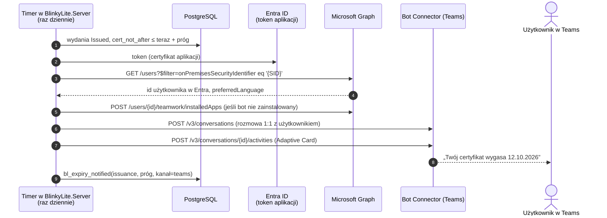

# 09 — Powiadomienie o wygaśnięciu przez bota Microsoft Teams (po 1.0)

Patch 0060. Serwer raz dziennie sprawdza, czyj certyfikat niedługo wygaśnie,
i wysyła temu użytkownikowi **prywatną wiadomość w Teams** od bota
BlinkyLite. To tylko informacja: bot niczego nie odnawia i nie dotyka karty
ani CA. Odnowienie robi Blinky albo operator nowym wydaniem.

## Jak to działa



- **Bot jednokierunkowy.** Manifest aplikacji Teams ma
  `"isNotificationOnly": true` — użytkownik nie może do bota pisać, więc
  serwer **nie potrzebuje publicznego endpointu przychodzącego**. Wystarczy
  ruch wychodzący.
- **Bez SDK bota.** Do samego wysyłania wystarcza REST Bot Connectora i
  Graph przez `HttpClient` + token z MSAL (`Microsoft.Identity.Client`). SDK
  obsługuje głównie rozmowę, której tu nie ma, i byłby największą zależnością
  w serwerze.
- **Użytkownik po SID.** Wydanie zapisuje `objectSid` z AD; w Entra ID
  (środowisko hybrydowe, Entra Connect / Cloud Sync) ten sam SID jest w
  `onPremisesSecurityIdentifier`. Zmiana UPN nie psuje dopasowania.
- **Instalacja bota u użytkownika.** Wiadomość prywatna wymaga, żeby
  aplikacja była zainstalowana u odbiorcy. Serwer instaluje ją sam przez
  Graph (`installedApps`) przy pierwszym powiadomieniu — nikt nie musi tego
  robić ręcznie.

## Treść

Adaptive Card w języku użytkownika: `preferredLanguage` z Entra, a jeśli
brak albo nie jest jednym z czterech — domyślny z konfiguracji. Teksty z
katalogu `Messages` ([08](08-localization.md)), prostym językiem:

> **Twój certyfikat logowania kartą wkrótce wygaśnie**
> Klucz YubiKey nr 29051525 · certyfikat ważny do 12.10.2026 (za 7 dni)
> Zgłoś się do działu IT, żeby go odnowić.

Bez przycisków akcji — bot niczego nie obsługuje. Tekst „Zgłoś się do…”
i ewentualny link (np. do portalu zgłoszeń) są w konfiguracji.

## Konfiguracja

```json
"ExpiryNotification": {
  "Enabled": true,
  "ThresholdsDays": [ 30, 7 ],
  "RunAtUtc": "06:00",
  "DefaultLanguage": "en",
  "ContactText": { "en": "Contact IT to renew it.", "pl": "Zgłoś się do działu IT, żeby go odnowić." },
  "Teams": {
    "TenantId": "…",
    "ClientId": "…",
    "CertificateThumbprint": "…",
    "TeamsAppId": "…",
    "ServiceUrl": "https://smba.trafficmanager.net/teams/"
  }
}
```

Progi 30 i 7 dni to wartości domyślne; każdy próg wysyła się dla danego
wydania dokładnie raz (`expiry_notifications`, unikalne
`issuance_id` + `threshold_days`). Wydanie w stanie `Superseded` nie dostaje
powiadomień — użytkownik ma już nowszą kartę.

## Co przygotowuje administrator (raz)

1. **Rejestracja aplikacji w Entra ID** z **certyfikatem** (nie hasłem);
   certyfikat w `LocalMachine\My` (Windows/MSIX) albo w Docker secret.
2. **Uprawnienia aplikacyjne Graph**, zgoda administratora:
   `User.Read.All` (znalezienie użytkownika po SID),
   `TeamsAppInstallation.ReadWriteSelfForUser.All` (zainstalowanie bota u
   użytkownika — tylko tej jednej aplikacji, nie dowolnych).
3. **Azure Bot** powiązany z tą rejestracją, z włączonym kanałem Microsoft
   Teams.
4. **Aplikacja Teams** (manifest z `bots[].isNotificationOnly = true`,
   ikona, nazwa „BlinkyLite”) wgrana do katalogu organizacji przez
   administratora Teams. Manifest i ikony leżą w `packaging/teams/`.
5. **Ruch wychodzący z serwera** do `login.microsoftonline.com`,
   `graph.microsoft.com`, `smba.trafficmanager.net` (HTTPS 443).

## Błędy

| Sytuacja | Co się dzieje |
|---|---|
| Brak użytkownika w Entra o tym SID (konto tylko on-premises) | brak wysyłki, audyt `cert.expiry-notify-failed` z powodem `user-not-in-entra`; widoczne w przeglądarce dla Admina |
| Graph / Bot Connector niedostępny | ponowna próba przy następnym uruchomieniu; próg nie jest oznaczany jako wysłany |
| Użytkownik zablokował bota | audyt `cert.expiry-notify-failed`, bez ponawiania |
| Serwer wyłączony w dniu progu | następne uruchomienie wysyła zaległy próg (warunek „≤ teraz + próg”, nie „= dokładnie”) |

Dwa progi w jednym uruchomieniu (np. serwer leżał tydzień) → wysyłany jest
tylko najbliższy, a starsze oznaczane jako pominięte — użytkownik nie
dostaje dwóch wiadomości naraz.
